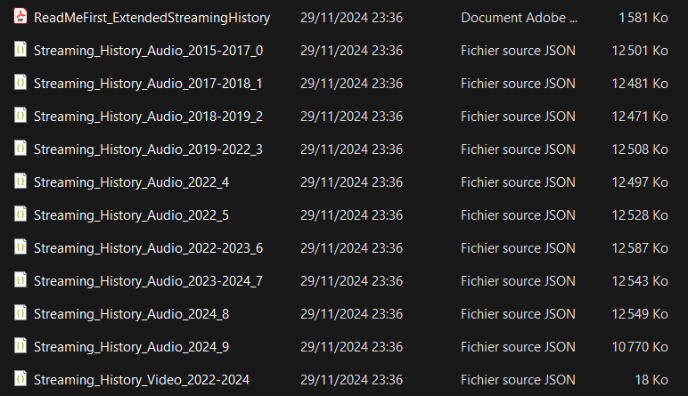

# Spotify Data Processor

<!-- TABLE OF CONTENTS -->
<details>
  <summary>Table of Contents</summary>
  <ol>
    <li>
      <a href="#overview">Overview</a>
      <ul>
        <li><a href="#requesting-your-data">Requesting Your Data</a></li>
        <li><a href="#downloading-your-data">Downloading Your Data</a></li>
      </ul>
    </li>
    <li>
      <a href="#preparing-to-run-the-code">Preparing to Run the Code</a>
    </li>
    <li>
      <a href="#results">Results</a>
      <ul>
        <li><a href="#input-data">Input Data</a></li>
        <li><a href="#output-data">Output Data</a></li>
      </ul>
    </li>
    <li>
      <a href="#limitations-and-recommendations">Limitations and Recommendations</a>
      <ul>
        <li><a href="#using-the-lastfm-api-for-dynamic-updates">Using the Last.fm API for Dynamic Updates</a></li>
      </ul>
    </li>
  </ol>
</details>


<!-- OVERVIEW -->
## Overview

Spotify is a popular music streaming platform that centralizes a vast collection of artists and songs, allowing users to listen to their favorite music. Spotify provides an API that offers diverse information about artists, playlists, trends, and more (see the documentation [here](https://developer.spotify.com/documentation/web-api)). However, the API has limitations. For example, it does not provide metrics like the number of times you’ve listened to a specific song.

Fortunately, there is a workaround: you can request your streaming history from Spotify. However, this raw data requires preprocessing to make it usable for analytics and dashboard creation.

---

### Requesting Your Data

The first step is to request your extended streaming history from Spotify. You can do this [here](https://www.spotify.com/uk/account/privacy/). Note that the process can be lengthy, taking up to **30 days** for Spotify to prepare the data.

---

### Downloading Your Data

Once Spotify notifies you that your data is ready, you can download and unzip the provided folder. It will contain multiple files, including those starting with `Streaming_History_Audio`. These JSON files are of primary interest, as they contain detailed information about every song you’ve played.



To streamline the process:
1. Remove all other irrelevant files from the folder.
2. Place the relevant `Streaming_History_Audio` files in a folder named **`input`** at the root of this repository.

---

## Preparing to Run the Code

Now that your data is ready, follow these steps:

1. Clone the repository to your local machine.
2. Place the **`input`** folder at the root of the repository.
3. Install the required dependencies by running the following command in your terminal:
   ```sh
   py -m pip install -r requirements.txt
   ```
4. Process your data by running the main script:
   ```sh
   py src/main.py
   ```

<!-- RESULTS -->
## Results

### Input data

The raw JSON files contain entries with the following fields:

| Field Name                         | Description                                                                                                                                                   |
|------------------------------------|---------------------------------------------------------------------------------------------------------------------------------------------------------------|
| ts                                 | Timestamp indicating when the track stopped playing in UTC (Coordinated Universal Time). Format: YYYY-MM-DD HH:mm:ss (military time).                         |
| username                           | Your Spotify username.                                                                                                                                        |
| platform                           | Platform used for streaming the track (e.g., Android OS, Google Chromecast).                                                                                  |
| ms_played                          | Number of milliseconds the stream was played.                                                                                                                 |
| conn_country                       | Country code of the country where the stream was played (e.g., SE for Sweden).                                                                                |
| ip_addr_decrypted                  | IP address logged during the stream.                                                                                                                          |
| user_agent_decrypted               | User agent used during the stream (e.g., a browser like Mozilla Firefox or Safari).                                                                           |
| master_metadata_track_name         | Name of the track.                                                                                                                                            |
| master_metadata_album_artist_name  | Name of the artist, band, or podcast.                                                                                                                         |
| master_metadata_album_album_name   | Name of the album of the track.                                                                                                                               |
| spotify_track_uri                  | Spotify URI uniquely identifying the track (e.g., spotify:track:<base-62 string>).                                                                            |
| episode_name                       | Name of the podcast episode.                                                                                                                                  |
| episode_show_name                  | Name of the podcast show.                                                                                                                                     |
| spotify_episode_uri                | Spotify Episode URI uniquely identifying the podcast episode (e.g., spotify:episode:<base-62 string>).                                                        |
| reason_start                       | Value indicating why the track started (e.g., trackdone).                                                                                                     |
| reason_end                         | Value indicating why the track ended (e.g., endplay).                                                                                                         |
| shuffle                            | Boolean (True or False) indicating if shuffle mode was used.                                                                                                  |
| skipped                            | Indicates if the user skipped to the next song.                                                                                                               |
| offline                            | Boolean (True or False) indicating if the track was played in offline mode.                                                                                   |
| offline_timestamp                  | Timestamp of when offline mode was used (if applicable).                                                                                                      |
| incognito_mode                     | Boolean (True or False) indicating if the track was played during a private session.                                                                          |

### Output data

The output JSON file is cleaned and simplified to include only relevant fields for analytics purposes. It retains only tracks played for more than 30 seconds, regardless of whether they were skipped. The resulting entries contain:

| Field Name                         | Description                                                                                                                                                   |
|------------------------------------|---------------------------------------------------------------------------------------------------------------------------------------------------------------|
| timestamp                          | Timestamp indicating when the track stopped playing in UTC (Coordinated Universal Time). Format: YYYY-MM-DD HH:mm:ss (military time).                         |
| duration                           | Number of milliseconds the stream was played.                                                                                                                 |
| track_name                         | Name of the track.                                                                                                                                            |
| artist_name                        | Name of the artist, band, or podcast.                                                                                                                         |
| album_name                         | Name of the album of the track.                                                                                                                               |
| spotify_track_uri                  | Spotify URI uniquely identifying the track (e.g., spotify:track:<base-62 string>).                                                                            |
| skipped                            | Indicates if the user skipped to the next song.                                                                                                               |

<!-- LIMITATIONS AND RECOMMENDATIONS -->
## Limitations and Recommendations

This approach provides static data, meaning you only have access to your listening history up to the moment Spotify prepares and sends the files. Unfortunately, there’s no direct way to dynamically update this data since the Spotify API lacks an endpoint to fetch historical listening information in real-time.

---

### Using the Last.fm API for Dynamic Updates

To overcome this limitation, consider creating an account on [Last.fm](https://www.last.fm/) and linking it to your Spotify account. Last.fm continuously tracks your listening history, logging any track played for more than 30 seconds.

By using the Last.fm [API](https://www.last.fm/api), you can:
- **Fetch ongoing listening history**: Access your listening data in real time from the moment you link your account.
- **Combine static and dynamic data**: Concatenate Last.fm's dynamic data with your static Spotify history.
- **Create dynamic dashboards**: Build dashboards that update in real time, reflecting your latest listening activity.

This hybrid approach combines the completeness of Spotify’s static data with Last.fm’s dynamic tracking for a comprehensive and up-to-date analytics experience.
